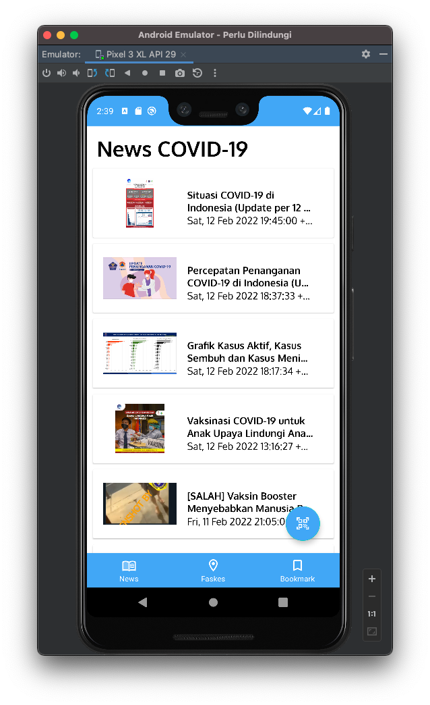
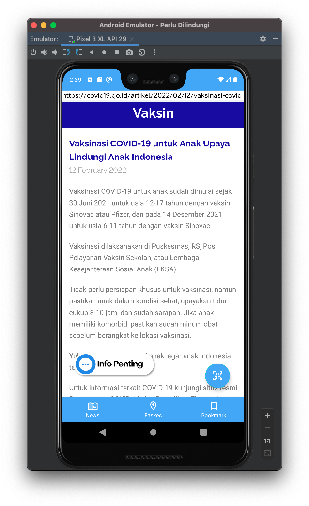
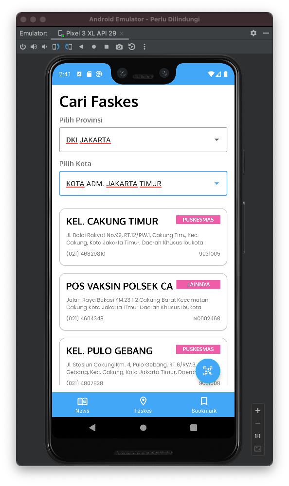
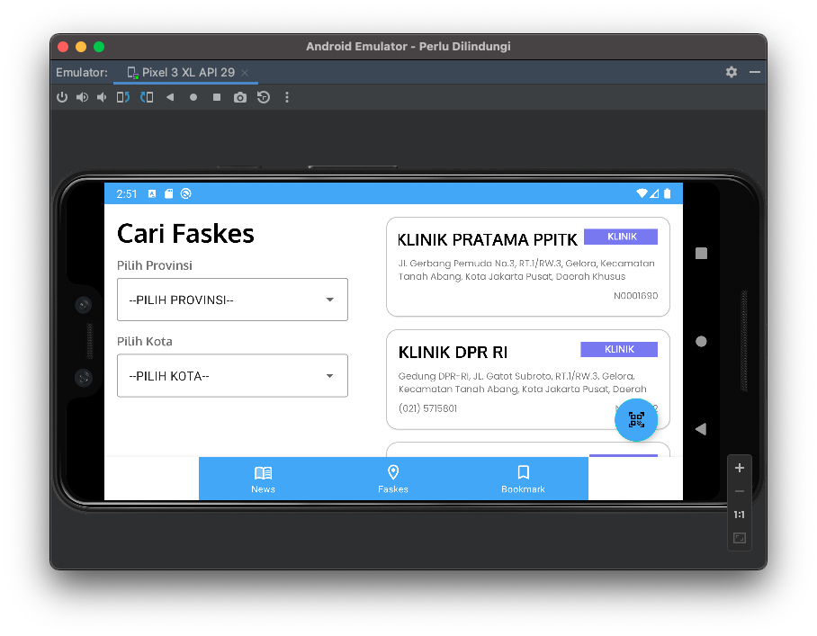
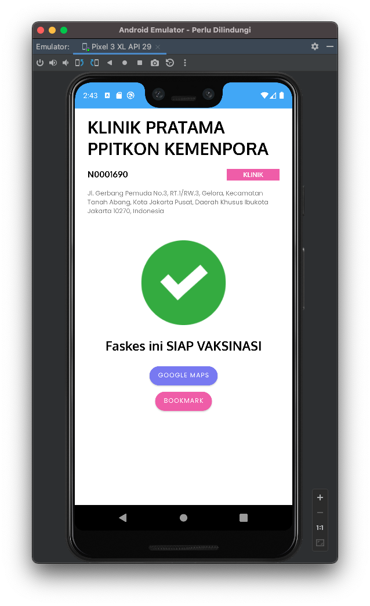
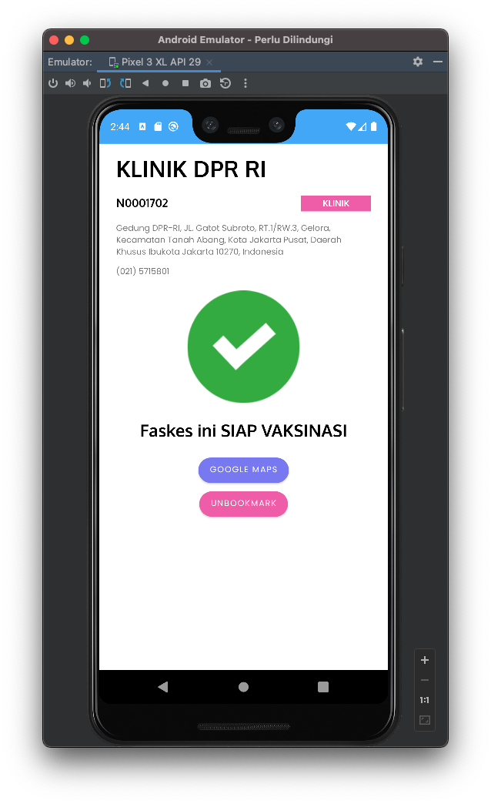
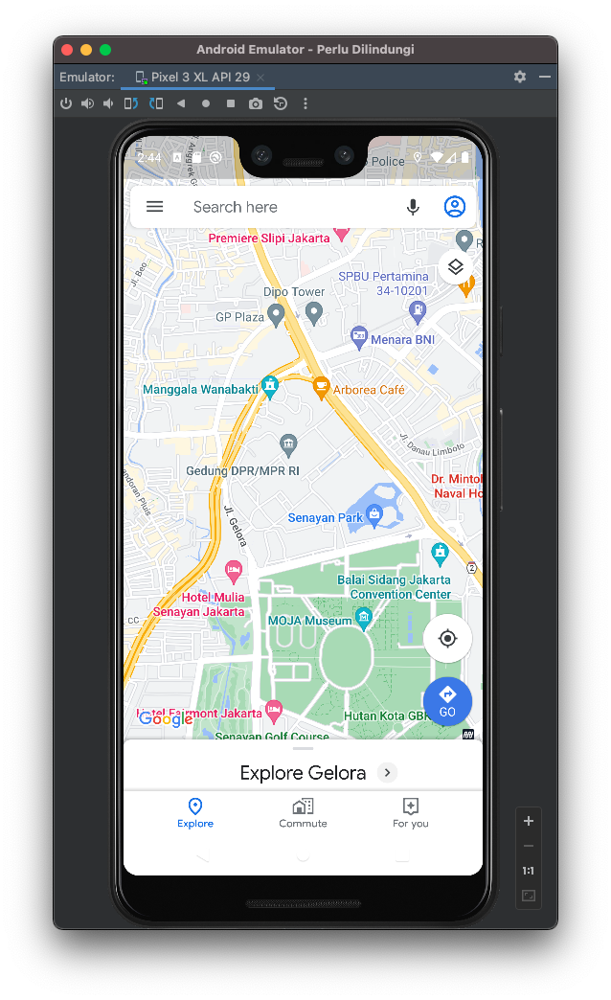
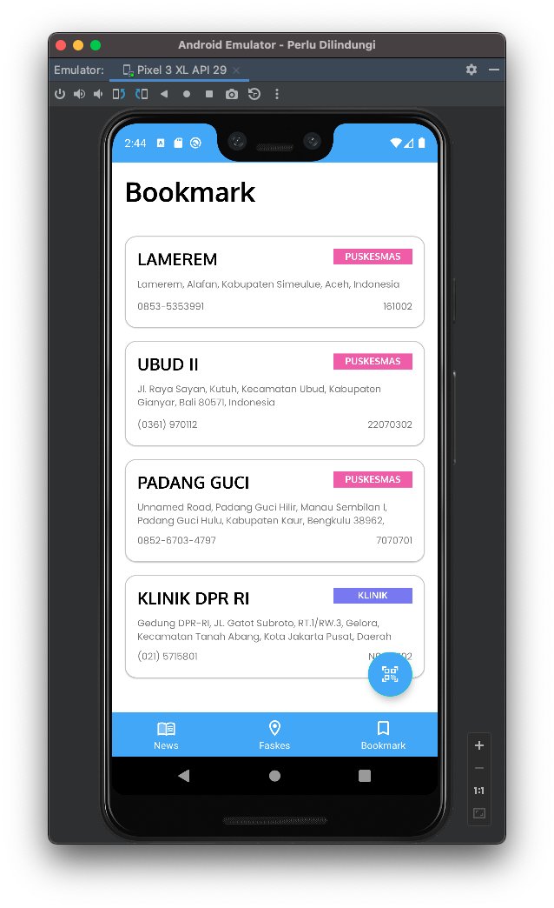
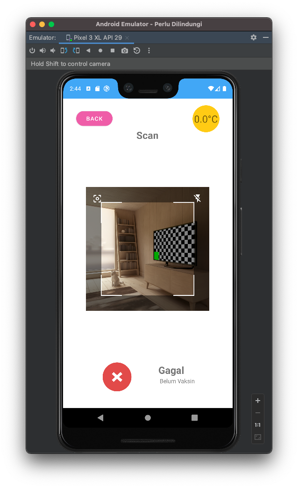

# Tugas Besar 1 - Android: IF3210 Pengembangan Aplikasi pada Platform Khusus

Aplikasi Perlu Dilindungi 
IF3210 - Pengembangan Aplikasi pada Platform Khusus

## Authors
- Feralezer L. G. Tampubolon (13519062)
- Shifa Salsabiila (13519106)
- Mohammad Afif Akromi (13519110)

## 1. Deskripsi Aplikasi
Perlu Dilindungi merupakan sebuah aplikasi pada platform Android yang didesain untuk memberikan pengguna informasi terkait Covid-19 di Indonesia. Fitur-fitur utama yang ada pada aplikasi ini adalah:
1. Menampilkan Berita COVID-19
2. Menampilkan Daftar Faskes untuk Vaksinasi
3. Menampilkan Detail Informasi Faskes
4. Menampilkan Daftar Bookmark Faskes
5. Melakukan "Check-In"

## 2. Cara Kerja Aplikasi
1. **Menampilkan Berita COVID-19** 
Fitur menampilkan berita COVID-19: Fitur ini dikemas dalam bentuk 1 activity dan 2 fragment. Fragment pertama adalah untuk menampilkan daftar berita, fragment kedua adalah untuk menampilkan halaman web berita yang dipilih. Ketika activity berita dijalankan, activity akan otomatis memanggil fragment pertama. Fragment pertama akan mem-fetch daftar berita dari API PerluDilindungi menggunakan Retrofit. Daftar berita tersebut kemudian dikemas dalam bentuk RecyclerView yang akan ditampilkan kepada pengguna oleh fragment pertama. Tidak lupa diberikan click listener pada setiap item RecyclerView, agar ketika pengguna men-tap suatu item RecyclerView, pengguna akan diarahkan—serta informasi berita yang disimpan oleh item RecyclerView tersebut akan dikirim—ke fragment kedua. Fragment kedua akan menggunakan WebView untuk menampilkan halaman berita tersebut kepada pengguna.

2. **Menampilkan Daftar Faskes untuk Vaksinasi** 
Pada halaman daftar faskes, terdapat filter provinsi, serta filter kota yang dapat digunakan pengguna untuk mencari lima faskes terdekat dengan posisinya berdasarkan filter lokasi yang dimasukkan. Untuk pengisian filternya, pengguna dapat pertama mengisi input provinsi terlebih dahulu dari daftar provinsni yang tersedia pada dropdown. Daftar provinsi diambil dari API Perlu Dilindungi pada saat halaman daftar faskes pertama dibuat. Setelah memilih provinsi, pengguna dapat memilih kota yang ada pada provinsi tersebut, sesuai dengan daftar pilihan kota yang muncul pada dropdown. Daftar kota didapatkan dengan memanggil API call kota dengan parameter input provinsi sesuai dengan provinsi yang dimasukkan pengguna pada saat pengguna melakukan perubahan pada pilihan provinsi. Selanjutnya, lima daftar faskes yang sesuai akan muncul pada layar pengguna, akibat pemanggilan method get faskes dengan parameter provinsi dan kota sesuai dengan masukan pengguna ketika pengguna telah selesai melakukan perubahan pada input kota.    Tampilan daftar faskes dibuat dengan menggunakan recycler view, dengan sebelumnya memasukkan hasil response dari pemanggilan API terhadap sebuah fungsi sort untuk mengurutkan faskes dari yana paling dekat hingga yang paling jauh relatif terhadap lokasi pengguna. Halaman daftar faskes sendiri dibuat dengan menggunakan Activity, namun didalamnya, komponen untuk menampilkan recycler view daftar faskes yang ada dibuat dengan menggunakan fragment. Halaman daftar faskes ini juga dibuat responsif, sehingga dalam orientasi portrait, filter pemilihan provinsi dan kota akan terletak di atas recycler view daftar faskes, sementara pada orientasi landscape, filter pemilihan provinsi dan kota akan terletak di sebelah kiri recycler view daftar faskes.

3. **Menampilkan Detail Informasi Faskes** 
Halaman detail informasi faskes menampilkan informasi nama, kode, alamat, nomor telpon, jenis, dan status dari masing-masing faskes. Halalman ini dapat diakses dengan cara menekan salah satu bagian dari recycler view yang terdapat pada halaman 'Daftar Faskes'. Informasi mengenai faskes terkait dikirimkan kepada halaman detail dengan membuat objek Faskese menjadi sebuah parcelable data yang dapat dikirim melalui sebuah intent. Pada halaman detail informasi, Faskes terkait diterima dan atribut-atributnya diatur menjadi nilai dari setiap bagian view yang bersesuaian.    Pada halaman detail informasi faskes juga terdapat tombol untuk melakukan bookmark/unbookmark faskes. Tombol ini akan memanggil sebuah fungsi query insert (untuk bookmark) dan delete (untuk unbookmark) faskes terkait pada database bookmark yang dibuat dengan menggunakan SQLite Room Database. Terdapat juga tombol google maps pada halaman detail. Tombol google maps ini menggunakan intent dengan parameter input latitude dan longitude faskes terkait.  

4. **Menampilkan Daftar Bookmark Faskes** 
Daftar bookmark faskes diimplementasikan menggunakan sebuah Activity yang mengandung fragment daftar faskes di dalamnya. Konten dari daftar bookmark sendiri diambil dari database bookmark yang diimplementasikan menggunakan SQLite Room Database. Fragment daftar faskes yang digunakan pada daftar bookmark merupakan fragment yang sama dengan yang digunakan pada halaman daftar faskes. 

5. **Melakukan "Check-In"** 
Halaman check-in dibuat agar pengguna dapat menggunakan QR Code Scanner untnuk melakukan check-in. Pengecekan QR Code dilakukan dengan memanggil API Perlu Dilindungi dan response yang didapatkan diklasifikasikan menjadi status black, red, yellow, atau green berdasarkan atribut userStatus. Halaman check-in juga dapat menerima dan menampilkan informasi suhu kamar pengguna dengan memanfaatkan sensor temperatur pada perangkat Anndroid pengguna. 

## 3. Library yang Digunakan 
1. room-compiler  : Digunakan untuk implementasi database bookmark
2. viewmodel-ktx  : Digunakan untuk mengimplementasikan seluruh viewmodel yang dibutuhkan, yaitu untuk daftar faskes, news, serta qrcode
3. retrofit       : Digunakan untuk pemanggilan API Perlu Dilindungi
4. glide          : Digunakan untuk melakukan load terhadap gambar yang digunakan pada halaman news
5. livedata-ktx   : Digunakan dalam implementasi MVVM, untuk membuat sebuah objek pada viewmodel yang dapat diobserve dari view
6. code-scanner   : Digunakan dalam implementasi scanner check-in

## 4. Screenshot Aplikasi 
### 4.1. Halaman Berita

### 4.2. Halaman Daftar Faskes 

### 4.3. Halaman Detail Faskes 

### 4.4. Halaman Bookmark 

### 4.5. Halaman Check-in

## 5. Pembagian Tugas 
| Fitur                 | 13519062           | 13519106           | 13519110           |
| ---                   | ---                | ---                | ---                |
| Halaman Berita        | :white_check_mark: |                    |                    |
| Halaman Daftar Faskes |                    | :white_check_mark: |                    |
| Halaman Detail Faskes |                    | :white_check_mark: |                    |
| Halaman Bookmark      |                    | :white_check_mark: |                    |
| Halaman Check-in      |                    |                    | :white_check_mark: |
| Setup Retrofit        | :white_check_mark: | :white_check_mark: | :white_check_mark: |
| Setup Glide           | :white_check_mark: |                    |                    |
| Setup Database        |                    | :white_check_mark: |                    |
| Setup Code Scanner    |                    |                    | :white_check_mark: |
| Navigation            | :white_check_mark: | :white_check_mark: | :white_check_mark: |

